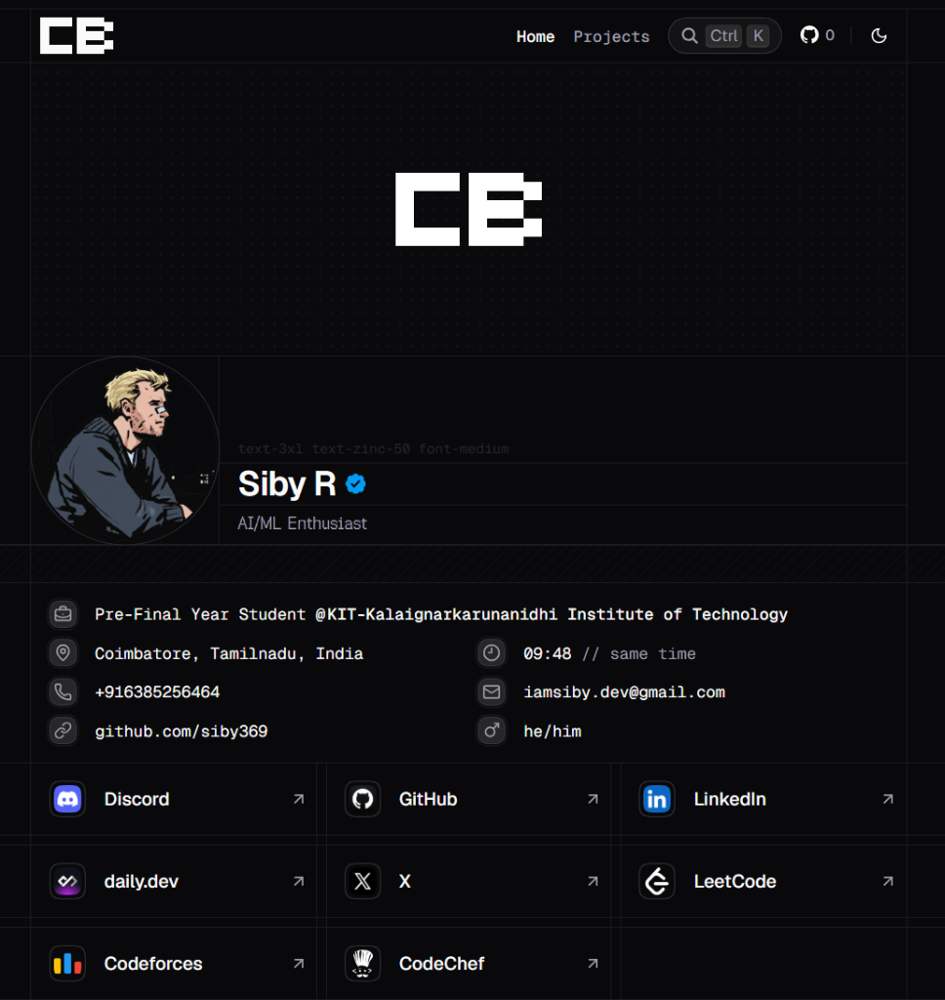

# siby.com

A minimal, pixel-perfect developer & competitive programming portfolio built with Next.js, React, and Tailwind CSS.



## Tech Stack

- **Framework:** Next.js (App Router)
- **Styling:** Tailwind CSS + Radix UI / Motion
- **Animations:** Motion (Framer Motion)
- **Deployment:** Vercel

## Running Locally

1. Clone the repository:
   ```bash
   git clone https://github.com/siby369/siby.com.git
   ```

2. Install dependencies:
   ```bash
   pnpm install
   ```

3. Run the development server:
   ```bash
   pnpm dev
   ```

Open [http://localhost:1408](http://localhost:1408) to see the result.

## License

MIT © [Siby R](https://github.com/siby369)
